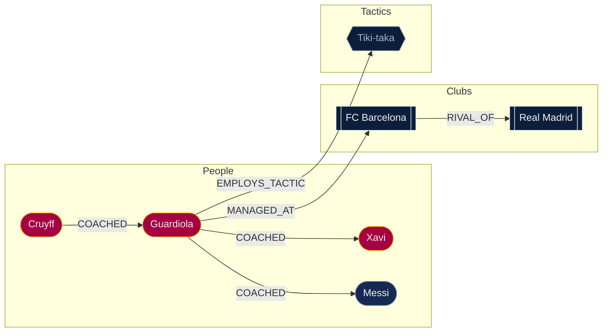

# Cantera

*Where coaches are grown, not appointed.*

Cantera is a graph-native explorer of football's coaching lineages — who
coached whom, who managed which club when, and how influence (personal and
tactical) carries forward from a player's career into the next generation of
managers. Built on [CognoDB](https://console.cognodb.com), a managed graph
database speaking openCypher over Bolt.

## Why a graph database?

The questions this app is built to answer are relational by nature —
"who is connected to whom, through how many hops, via what kind of
relationship" — not "which rows match this filter." That distinction is
what makes a graph database the right tool here rather than a stylistic
choice:

- **Lineage chains are variable-depth by nature.** `Cruyff → Guardiola →
  Xavi` is three hops; `Sacchi → Ancelotti → Zidane` is a different chain of
  a different length, through a different relationship type
  (`COACHED` then `ASSISTANT_TO`). Modeling "everyone within N hops of this
  manager's influence" in SQL means a recursive CTE with a depth you don't
  know in advance. In Cypher it's one variable-length pattern:
  `(m:Manager)-[:COACHED*1..3]-(other)`.
- **The headline query needs a *bidirectional* variable-length traversal
  plus a negative existence check** — "find two managers who share a
  coaching influence within 3 hops on *either side*, but never worked at
  the same club." In SQL this is two independent recursive CTEs (one per
  manager), joined and de-duplicated, then anti-joined against club
  tenures. In Cypher it's a single readable `MATCH` (see below). This is
  the kind of query relational engines handle progressively worse the
  deeper the lineage gets; Cypher's cost stays proportional to the actual
  graph traversed, not to a join explosion.
- **The schema itself is graph-shaped, not table-shaped.** A person can be
  a player, a manager, or both, and which they are isn't a fixed category —
  it's determined by which edges exist. Modeling that in a relational
  schema means either a nullable "manager_id" self-reference column with
  awkward NULL semantics, or a join table that exists purely to simulate
  what a graph gives you natively: an edge.

## Data model



**Nodes**
| Label | Meaning |
|---|---|
| `Person` | Everyone in the dataset — players and managers alike |
| `Manager` | An *additional* label (not a separate node) on any `Person` who has managed a club. A person can hold both — e.g. Guardiola is `Person:Manager`, Messi is `Person` only |
| `Club` | A football club |
| `Tactic` | A named tactical system (Tiki-taka, Gegenpressing, etc.) |

**Relationships**
| Relationship | Direction | Meaning |
|---|---|---|
| `COACHED` | `(Manager)→(Person)` | Coach to protege, from a playing-career relationship. Whether someone "is a coach" falls out of whether they have *outgoing* `COACHED` edges — not a stored flag. This is the relationship the lineage queries traverse. |
| `ASSISTANT_TO` | `(Manager)→(Manager)` | A genuine staff appointment (assistant/reserve coach), kept distinct from `COACHED` since it's a different kind of influence |
| `MANAGED_AT` | `(Manager)→(Club)`, has a `years` property | A managerial tenure. `years` is part of the merge key so a manager's separate spells at the same club create distinct edges |
| `EMPLOYS_TACTIC` | `(Manager)→(Tactic)` | A tactical system associated with that manager |
| `RIVAL_OF` | `(Club)→(Club)`, mirrored both ways | A club rivalry |

## Setup

1. Create a free CognoDB instance at [console.cognodb.com/signup](https://console.cognodb.com/signup) (no credit card required for the free tier)
2. Copy `.env.example` to `.env.local` and fill in your `COGNODB_URI`, `COGNODB_USER`, and `COGNODB_PASSWORD`
3. `npm install`
4. `npm run seed` — loads the dataset (idempotent — safe to re-run any time the data changes)
5. `npm run dev` — visit `localhost:3000`

## The queries

All Cypher lives in `lib/queries.ts`, called only through the parameterized
`runQuery` helper in `lib/db.ts` — nothing here is string-concatenated.

### Multi-hop traversal — a manager's coaching lineage

Powers the search/focus view: everyone within N hops of a given manager's
`COACHED` chain, in either direction (their mentors, their proteges, and
so on transitively).

```cypher
MATCH (start:Manager {id: $managerId})
MATCH (start)-[:COACHED*1..3]-(other)
RETURN DISTINCT other
```

The hop bound (`3` above) can't actually be passed as a query parameter —
Neo4j requires a literal integer in a variable-length path pattern — so
`getManagerLineage()` clamps the requested hop count to an integer between
1 and 5 *before* it's interpolated into the query string, rather than
accepting arbitrary input.

### The headline query — "coaching cousins"

Two managers connected through shared coaching influence, at any depth up
to 3 hops on either side, who never managed the same club at the same
time. This is the query a relational schema handles worst: it needs two
independent unknown-depth traversals that meet in the middle, then a
negative join against club history.

```cypher
MATCH (a:Manager)-[:COACHED*1..3]->(common:Person)<-[:COACHED*1..3]-(b:Manager)
WHERE a.id < b.id
  AND NOT EXISTS {
    MATCH (a)-[:MANAGED_AT]->(club)<-[:MANAGED_AT]-(b)
  }
RETURN DISTINCT a.name AS managerA, b.name AS managerB, common.name AS sharedInfluence
ORDER BY managerA, managerB
```

`a.id < b.id` avoids returning each pair twice (once per direction) and
excludes a manager matching against himself. Run against the seed data,
this surfaces pairs like **Pep Guardiola & Luis Enrique** (both trace back
to **Johan Cruyff**), and — after the Premier League / Serie A expansion —
cross-league pairs like **Mikel Arteta & Vincent Kompany** (both trace
back to **Pep Guardiola**, one through a playing/staff route, one through
a playing route).

## Screenshots

*(to be added after deployment)*

## Deployment

Deployed on [Vercel](https://vercel.com). The three `COGNODB_*` environment
variables from `.env.local` are set in the Vercel project's environment
variables — never committed to the repo.

Live demo: *(link to be added)*